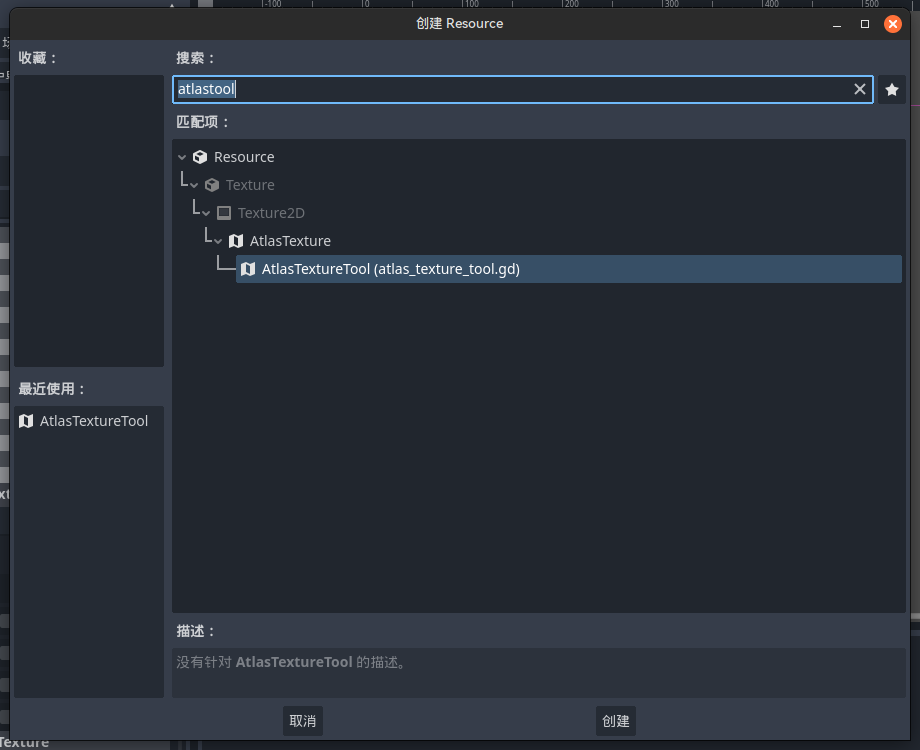
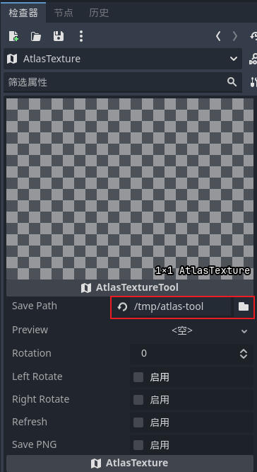
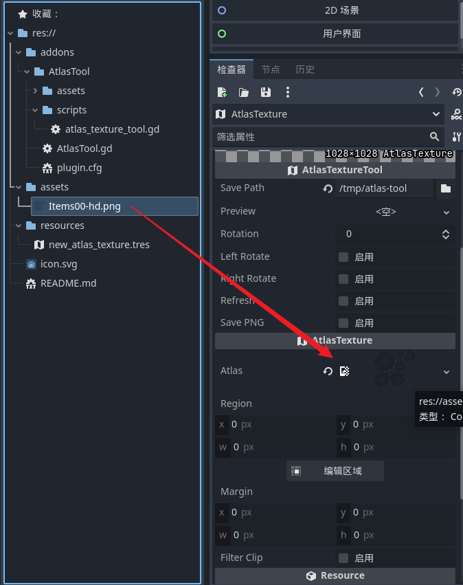
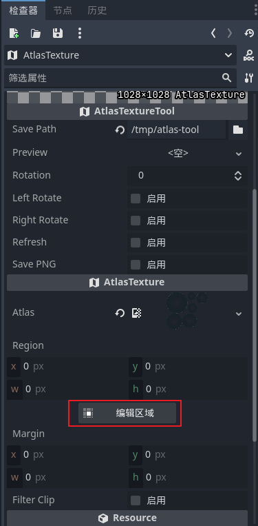
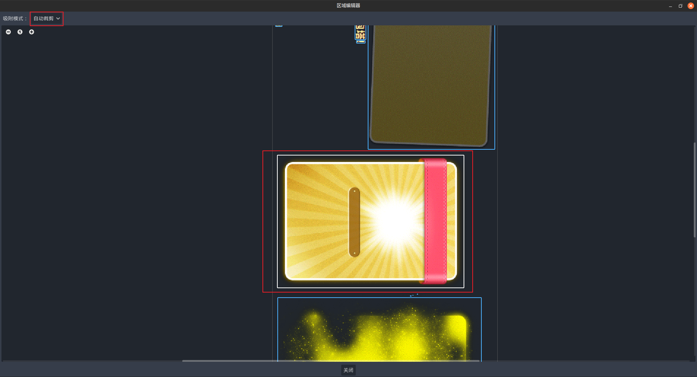
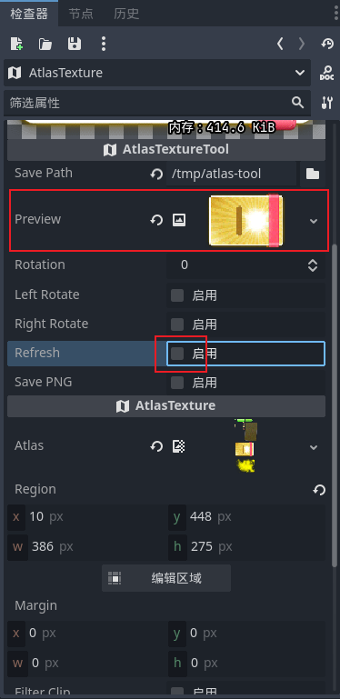
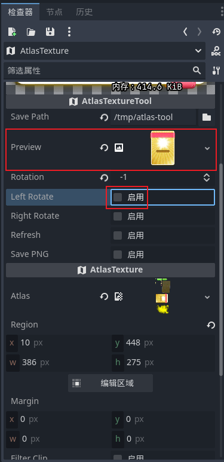
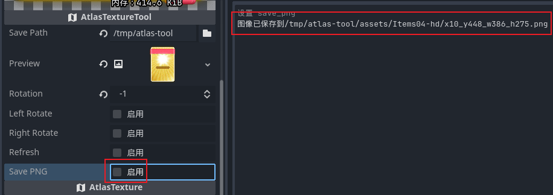
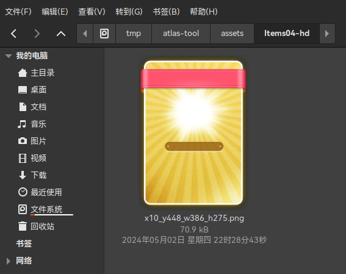

## AtlasTool

**纹理裁剪工具插件**

对于一些压缩过的精灵表（精灵可能排列不规则、甚至进行了旋转）使用AtlasTexture2D只能按照区域不能旋转精灵，使用此插件可以将精灵表拆成单个的精灵并将精灵手动调整回原来的角度，然后保存为png图片。

## 使用方法

### 导出插件

1. 将addons中的AtlasTool文件夹复制到项目的addons文件夹中
2. 点击项目 -> 项目设置 -> 插件 -> 开启AtlasTool插件

### 创建临时资源文件

1. 在项目内任意位置创建一个AtlasTextureTool类型的资源文件

   

   

2. 点击临时资源文件
3. 设置png保存目录

   

4. 将需要裁剪的精灵表图片拖入Atlas中

   

### 设置临时资源文件

1. 点击编辑区域、选择自动裁剪、选择需要处理的图块

   

   

2. 点击Refresh刷新预览效果

   

3. 进行旋转处理

   

4. 点击Save PNG将图块保存为png

   

5. 打开保存目录查看效果

   